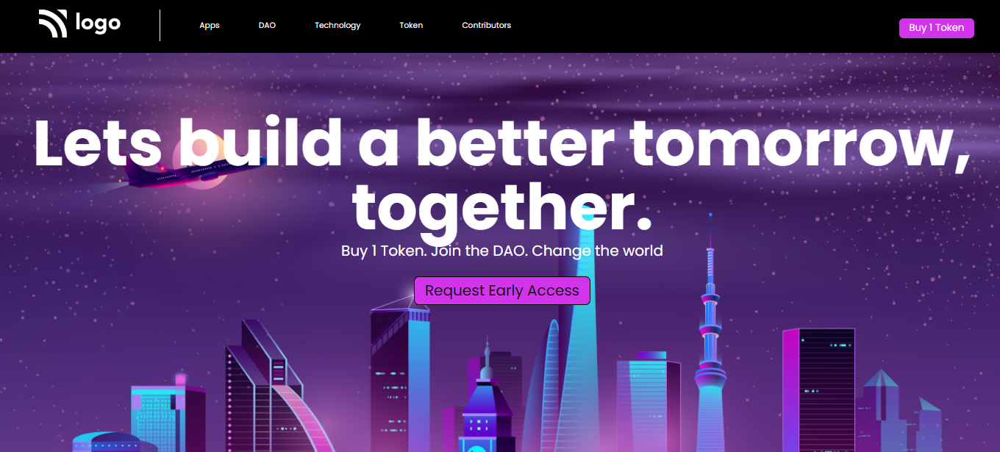

# Project 1 - HTML  and CSS 

> 
>
> By Naga Rajasekhar

You can find the live deployment link of this web page here --> **[#](#)**
 
 
 
 

 

### Learnings from completing this project

1. Gained knowledge about postions and its properties 
2. Learnt abput flex box and its properties
3. Gained knowledge about padding, margin, colors, border and their values
